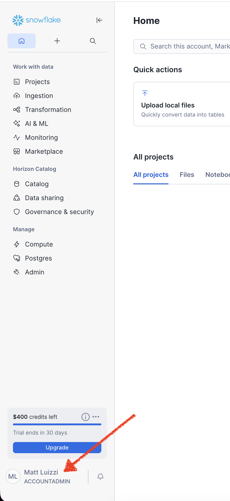
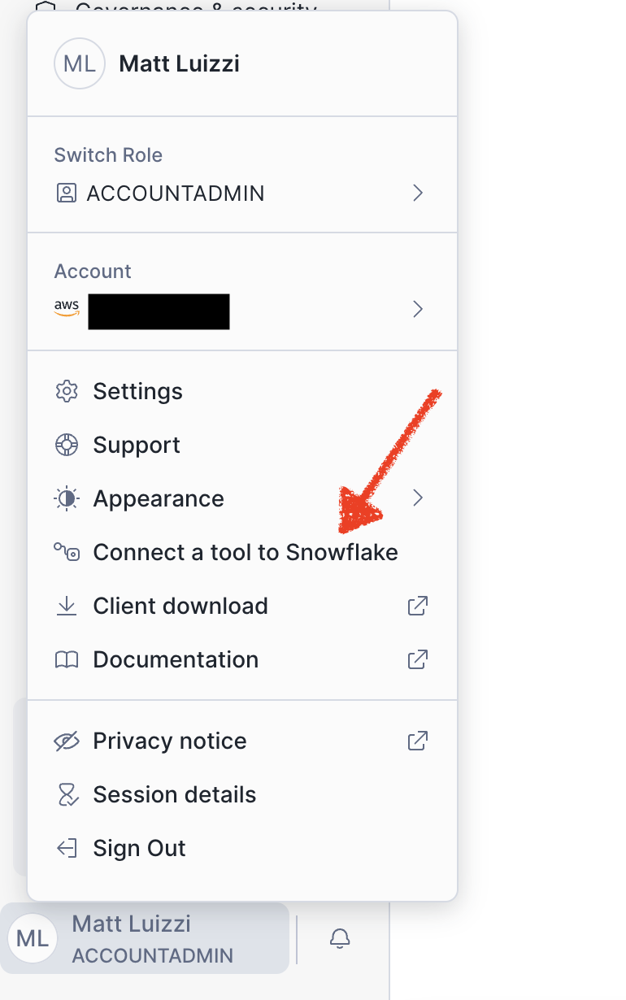
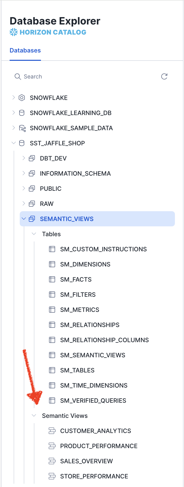
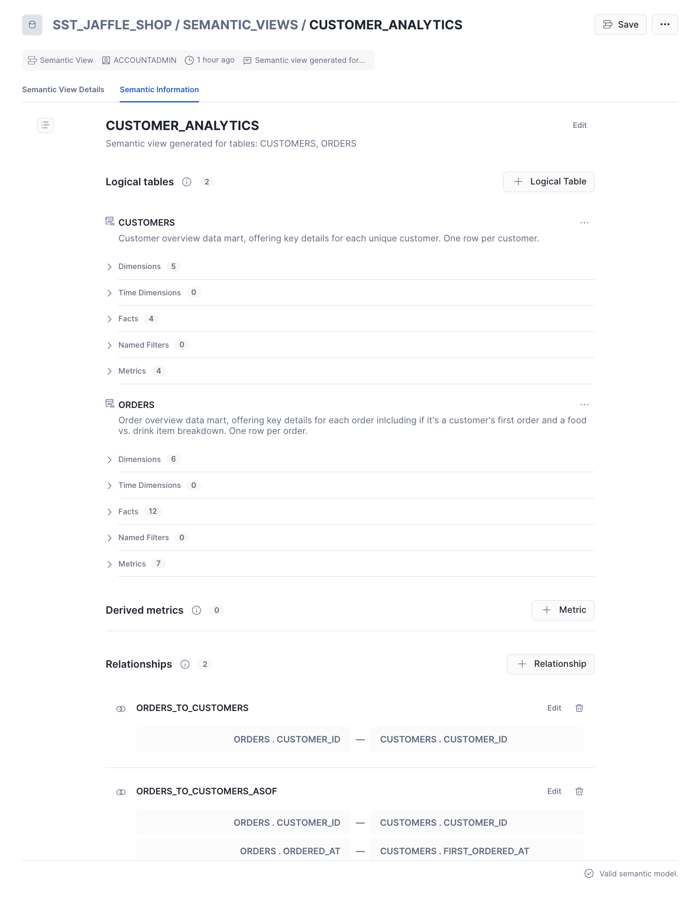

# SST Jaffle Shop Tutorial
This tutorial will take you through setting up a Snowflake trial account, setting up a new dbt project (using dbt Core) and connecting it to the Snowflake account, and building out a semantic layer using Snowflake Semantic Tools to create Snowflake Semantic Views.

## Prerequisites
- **Python 3.10 or 3.11**
- **Conda**

## Step 1 - Environment Setup

This tutorial is going to use Conda for environment management. If you don't have Conda installed on your machine, please set that up before proceeding.

1. Create a new Conda environment named `sst-jaffle-shop` using Python 3.11:
    ```
    conda create -n sst-jaffle-shop python=3.11 -y
    ```

2. After creating the environment, you will want to activate the environment.
    ```
    conda activate sst-jaffle-shop
    ```

3. Since both SST and dbt-snowflake are available on PyPI, we can use the following command to install both using the requirements file:
    ```
    pip install --index-url https://pypi.org/simple/ -r requirements.txt
    ```

    This will install:
    - `snowflake-semantic-tools`
    - `dbt-snowflake`

    **Note:** The above command explicitly uses PyPI via the `--index-url` flag to ensure you're installing from the official PyPI repository. You can omit the `--index-url` flag and run `pip install -r requirements.txt` if:
    - You're using CodeArtifact (which proxies PyPI) or another package repository
    - You're certain no other distributions exist in your configured pip channels


## Step 2 - Create a Snowflake Trial Account
1. Navigate to the [Snowflake free trial sign-up page](https://signup.snowflake.com/).
    - **Note:** Snowflake trial accounts are limited to 30 days and $400 in consumption. This is account is intended to suffice for this tutorial but should not be used for further SST development.
2. Enter in the required personal information.
    - **Note:** This tutorial was built by selecting the following options, but any should work.
        - **Snowflake Edition**: Enterprise
        - **Cloud**: AWS
        - **Region**: US East (Northern Virginia)
3. Click Sign Up. You will then need to flip to the email that you provided and click the link that was sent to activate your account.
4. Once in Snowflake, create a secure username and password to access your new Snowflake account.
5. Now that you are logged into your new Snowflake trial account, in the bottom left-hand corner click on [your name] ACCOUNTADMIN to open the profile menu

   

6. Inside that menu, you are going to want to click "Connect a tool to Snowflake". This is where you will find the credentials you need for

   

## Step 3 - Set up the dbt Project
1. Next, we will be creating a `profiles.yml` file to be used for the dbt project. This is where we will drop in the Snowflake credentials that you opened up in step 2.6 above. To do this:
    - Run `mkdir -p ~/.dbt` to create a `.dbt` directory if it doesn't already exist. If you already have one, this is a harmless operation.
    - Inside of the `.dbt` directory, you will need to make a `profiles.yml` file if it doesn't exist. If you already have a `profiles.yml` files, you will need to open it and add the following new profile to the bottom. If you don't have one, just create it and add the profile.
        ```yaml
            sst_jaffle_shop:
              target: dev
              outputs:
                dev:
                  type: snowflake
                  account: <your_new_snowflake_account_identifier>
                  user: <your_new_snowflake_user>
                  password: <your_new_snowflake_password>
                  role: ACCOUNTADMIN
                  database: SST_JAFFLE_SHOP
                  warehouse: COMPUTE_WH
                  schema: DBT_DEV
                  threads: 4
        ```
    - The values that need to be provided in this YAML above should map to your new Snowflake account, and can all be found inside of the "Connect a tool to Snowflake" menu.
    - **Note:** It is **NOT** best practice to store credentials directly in this file nor to use password authentication. This is for the purpose of the tutorial only and the public nature of the data going into this Snowflake account.

2. Save the `profiles.yml` file and close it. We won't need this anymore. The only thing you need to remember is the name of the profile, which in the example above is `sst_jaffle_shop` (the top row).

3. If you are cloning this repo, the dbt project should now be largely set up. In the `dbt_project.yml` file in the root directory of this repo that `profile: sst_jaffle_shop` is configured, so when you run dbt commands it will be connected to your new Snowflake trial account.

## Step 4 - Build the dbt project
1. The first step of building the dbt project will be writing some raw data to Snowflake. This project uses seed files, so we will write those seed files to Snowflake tables. First, you will need to create the database in Snowflake that we will be writing to. If you used the project default database name in your `profiles.yml` file, sst_jaffle_shop, we will need to create that in Snowflake. In a new Snowflake worksheet, run the following:
    ```SQL
    CREATE DATABASE IF NOT EXISTS SST_JAFFLE_SHOP;
    ```

2. Once that database is created, you can open a new terminal inside of this repo and run the following command:
    ```
    dbt seed --vars '{"load_source_data": true}'
    ```
    **Note:** Make sure the terminal you are using has the conda environment activated that we created in step 1. If it doesn't, please activate it by running `conda activate sst-jaffle-shop` before running any dbt commands.

    This will write the seed files to the schema `SST_JAFFLE_SHOP.RAW`.

3. Once that command finishes, you will now see 6 tables in that schema. Now we need to build all of the dbt models. Run the following command which will generate 7 tables and 6 views into the schema `SST_JAFFLE_SHOP.DBT_DEV` (which again was confifured in our `profiles.yml` file.)
    ```
    dbt run
    ```
4. Now that all of the dbt models are built, we are ready to use SST to build some semantic views!

## Pre-Step 5 - Making sure SST authenticates

**Important:** This step is optional and only for if you have Snowflake environment variables set in your shell (like `SNOWFLAKE_ACCOUNT`, `SNOWFLAKE_USER`, etc.) for a different account, SST will use those instead of your dbt profile. To use your trial account with SST, you have two options:

1. **Temporarily unset the environment variables** (recommended for this tutorial):
    ```bash
    unset SNOWFLAKE_ACCOUNT SNOWFLAKE_USER SNOWFLAKE_USERNAME SNOWFLAKE_ROLE SNOWFLAKE_WAREHOUSE SNOWFLAKE_PASSWORD
    ```
    Then SST will use the dbt profile from `~/.dbt/profiles.yml`.

2. **Set environment variables for your trial account**:
    ```bash
    export SNOWFLAKE_ACCOUNT=<your_trial_account_identifier>
    export SNOWFLAKE_USER=<your_trial_username>
    export SNOWFLAKE_ROLE=ACCOUNTADMIN
    export SNOWFLAKE_WAREHOUSE=COMPUTE_WH
    export SNOWFLAKE_PASSWORD=<your_trial_password>
    ```

After unsetting or updating the environment variables, SST commands will connect to your trial account instead of your default Snowflake account.

> There is an open [feature request](https://github.com/WhoopInc/snowflake-semantic-tools/issues/61) in SST to combine the Snowflake authentication for dbt and SST to read from the `~/.dbt/profiles.yml`.

## Step 5 - Using SST to Enrich a SQL model
You'll notice that most of the models in the `models/` directory have a SQL file (i.e `models/marts/customers.sql`) as well as a YAML file (i.e `models/marts/customers.yml`). 

If you look inside that YAML file, you will see that there is a lot of metadata about a the table and all of the columns! These align exactly with what Snowflake Semantic Views support and highlights the power of SST.

However, you will notice that the model `supplies.sql` does NOT have a YAML file associated yet. Let's use SST to create it:

Using SST, this is a simple command. Simply run the following in a terminal, and when the command completes you will see that a new file was created!
```
sst enrich models/marts/supplies.sql --all
```
This tells SST the path to the model that you would like to enrich, and the `--all` flag tells SST the type of metadata you would like enriched. For a full list of the types of supported metadata for enrichment, refer to the [SST CLI reference docs](https://github.com/WhoopInc/snowflake-semantic-tools/blob/main/docs/cli-reference.md).

> **Tip:** When you implement SST into your own dbt repo, you can run `sst enrich models/ --all` to run every model in the models directory at once!

You'll also notice that description fields were created for all columns but left null. This is by design - descriptions are critical for Cortex Analyst to understand your data, so please take the time to write descriptions for each of the columns in the supplies model now.

You will also notice that the table's primary key was created but left null. This is also by design and a very important part of SST. Because Snowflake Semantic Views perform joins, many relationships rely on understanding primary key/unique key relationships on a table. Without a primary key, a table cannot be used in SST. For our `supplies.yml` model, please put `supply_uuid` as the primary key. 

## Step 6 - Validating the SST Fields
In order to catch any potential issues early, we have developed the `sst validate` command to make sure everything will run smoothly downstream.

`sst validate` is designed to ensure that all metadata, metrics, etc. complies with the Snowflake Semantic View rules.

Let's run this command now to make sure we didn't accidentally introduce an error. In your terminal run `sst validate`.

Assuming everything has been done correctly so far, you should see that the validation passed with no issues.
```
18:52:40  Validation completed in 0.2s [OK]

━━━━━━━━━━━━━━━━━━━━━━━━━━━━━━━━━━━━━━━━━━━━━━━━━━━━━━━━━━━━━━━━━━━━━━
VALIDATION SUMMARY
━━━━━━━━━━━━━━━━━━━━━━━━━━━━━━━━━━━━━━━━━━━━━━━━━━━━━━━━━━━━━━━━━━━━━━
Status: PASSED - No issues found
Errors: 0
Warnings: 0
━━━━━━━━━━━━━━━━━━━━━━━━━━━━━━━━━━━━━━━━━━━━━━━━━━━━━━━━━━━━━━━━━━━━━━
```

If there were issues found, you would see them listed in your terminal. Some may just be warnings (we recommend fixing them for better Cortex Analyst performance, but they are optional) and some may be errors (commands downstream will fail, these will block progress).

## Optional Step 7 - explore `snowflake_semantic_models`

## Step 8 - Writing SST Metadata to Snowflake
Now that the dbt models are built, enriched and validated, we need to extract the resolve the Jinja templating and write the metadata to Snowflake for better performance later.

This is also an easy command built right into SST. We just need to tell the tool where we would like those tables to live, and run the command to extract the information.

Run the following in your terminal:
```
sst extract --db sst_jaffle_shop --schema semantic_views
```

This tells SST that we want to create a new schema, `semantic_views`, in the `sst_jaffle_shop` database. 

Once that command has finished running, you can open Snowflake and see that there are new tables created with all of the pieces of your semantic layer! This is how we will construct the semantic views in the next step.

## Step 9 - Build Semantic Views
This is where we can really see the power of SST and the improvement on development speed when working with Semantic Views.

If you open the file [`semantic_views.sql`](/snowflake_semantic_models/semantic_views.yml), you will see that there are 4 Semantic Views defined in YAML.

The only thing specified in our Semantic View definitions here are the view names, descriptions, and the tables included in them. The table names use a Jinja syntax that is similar to dbt, yet slightly different in that it doesn't use `ref()` to avoid any potential conflicts. Despite not having all of the other metadata defined in the semantic view definition, SST is able to pull it from all over the project to piece together the Semantic View in Snowflake.
Run the following command to generate those:
```
sst generate --metadata-db sst_jaffle_shop --metadata-schema semantic_views --target-db sst_jaffle_shop --target-schema semantic_views --all
```
This tells SST to find the metadata that we extracted in `sst_jaffle_shop.semantic_views` and create all semantic views defined in the project to the same schema.

Once that command completes, you will see that the semantic views now exist in Snowflake!



And as you can see in the image below, the Semantic View gets created with all of our dimensions, metrics, relationships, etc.!




## Step 10 - Build More
Now that you can see how to build semantic views natively within your dbt project, try building more metrics, relationships and even Cortex Agents on top of these semantic views


---

Thanks for trying Snowflake Semantic Tools! If you have any feedback or have discovered any issues, please report them according to the [contribution guidelines](https://github.com/WhoopInc/snowflake-semantic-tools/blob/main/CONTRIBUTING.md).

---

_Last updated December 31, 2025 - Some information may have changed, including: Snowflake trial account details, SST/dbt version requirements, Python version support, and Snowflake Semantic Views features._