# SST Jaffle Shop Tutorial
This tutorial will take you through setting up a Snowflake trial account, setting up a new dbt project (using dbt Core) and connecting it to the Snowflake account, and building out a semantic layer using Snowflake Semantic Tools to create Snowflake Semantic Views.

## Prerequisites
- **Python 3.10 or 3.11**
- **Conda**

## Step 1 - Environment Setup

This tutorial is going to use Conda for environment management. If you don't have Conda installed on your machine, please set that up before proceeding.

1. Create a new Conda environment named `sst-jaffle-shop` using Python 3.11:
    ```
    conda create -n sst-jaffle-shop python=3.11 -y
    ```

2. After creating the environment, you will want to activate the environment.
    ```
    conda activate sst-jaffle-shop
    ```

3. Since both SST and dbt-snowflake are available on PyPI, we can use the following command to install both using the requirements file:
    ```
    pip install --index-url https://pypi.org/simple/ -r requirements.txt
    ```

    This will install:
    - `snowflake-semantic-tools`
    - `dbt-snowflake`

    **Note:** The above command explicitly uses PyPI via the `--index-url` flag to ensure you're installing from the official PyPI repository. You can omit the `--index-url` flag and run `pip install -r requirements.txt` if:
    - You're using CodeArtifact (which proxies PyPI) or another package repository
    - You're certain no other distributions exist in your configured pip channels


## Step 2 - Create a Snowflake Trial Account
1. Navigate to the [Snowflake free trial sign-up page](https://signup.snowflake.com/).
    - **Note:** Snowflake trial accounts are limited to 30 days and $400 in consumption. This is account is intended to suffice for this tutorial but should not be used for further SST development.
2. Enter in the required personal information.
    - **Note:** This tutorial was built by selecting the following options, but any should work.
        - **Snowflake Edition**: Enterprise
        - **Cloud**: AWS
        - **Region**: US East (Northern Virginia)
3. Click Sign Up. You will then need to flip to the email that you provided and click the link that was sent to activate your account.
4. Once in Snowflake, create a secure username and password to access your new Snowflake account.
5. Now that you are logged into your new Snowflake trial account, in the bottom left-hand corner click on [your name] ACCOUNTADMIN to open the profile menu

   

6. Inside that menu, you are going to want to click "Connect a tool to Snowflake". This is where you will find the credentials you need for

   

## Step 3 - Set up the dbt Project
1. Next, we will be creating a `profiles.yml` file to be used for the dbt project. This is where we will drop in the Snowflake credentials that you opened up in step 2.6 above. To do this:
    - Run `mkdir -p ~/.dbt` to create a `.dbt` directory if it doesn't already exist. If you already have one, this is a harmless operation.
    - Inside of the `.dbt` directory, you will need to make a `profiles.yml` file if it doesn't exist. If you already have a `profiles.yml` files, you will need to open it and add the following new profile to the bottom. If you don't have one, just create it and add the profile.  We will add both a dev and prod environment here.
        ```yaml
            sst_jaffle_shop:
              target: dev
              outputs:
                dev:
                  type: snowflake
                  account: <your_new_snowflake_account_identifier>
                  user: <your_new_snowflake_user>
                  password: <your_new_snowflake_password>
                  role: ACCOUNTADMIN
                  warehouse: COMPUTE_WH
                  database: DEV
                  schema: SST_JAFFLE_SHOP
                  threads: 4
                prod:
                  type: snowflake
                  account: <your_new_snowflake_account_identifier>
                  user: <your_new_snowflake_user>
                  password: <your_new_snowflake_password>
                  role: ACCOUNTADMIN
                  warehouse: COMPUTE_WH
                  database: PROD
                  schema: SST_JAFFLE_SHOP
                  threads: 4                  
        ```
    - The values that need to be provided in this YAML above should map to your new Snowflake account, and can all be found inside of the "Connect a tool to Snowflake" menu.
    - **Note:** It is **NOT** best practice to store credentials directly in this file nor to use password authentication. This is for the purpose of the tutorial only and the public nature of the data going into this Snowflake account.

2. Save the `profiles.yml` file and close it. We won't need this anymore. The only thing you need to remember is the name of the profile, which in the example above is `sst_jaffle_shop` (the top row).

3. If you are cloning this repo, the dbt project should now be largely set up. In the `dbt_project.yml` file in the root directory of this repo that `profile: sst_jaffle_shop` is configured, so when you run dbt commands it will be connected to your new Snowflake trial account.

## Step 4 - Build the dbt project
1. The first step of building the dbt project will be writing some raw data to Snowflake. This project uses seed files, so we will write those seed files to Snowflake tables. First, you will need to create the database in Snowflake that we will be writing to. If you used the project default database name in your `profiles.yml` file, sst_jaffle_shop, we will need to create that in Snowflake. In a new Snowflake worksheet, run the following:
    ```SQL
    CREATE DATABASE IF NOT EXISTS DEV;
    ```
    ```SQL
    CREATE DATABASE IF NOT EXISTS PROD;
    ```

2. Once that database is created, you can open a new terminal inside of this repo and run the following command:
    ```
    dbt seed --vars '{"load_source_data": true}'
    ```
    **Note:** Make sure the terminal you are using has the conda environment activated that we created in step 1. If it doesn't, please activate it by running `conda activate sst-jaffle-shop` before running any dbt commands.

    Because we put `target: dev` as the second line in our `profiles.yml` file, which makes dev the default, this will write the seed files to the schema `DEV.RAW`.

3. Once that command finishes, you will now see 6 tables in that schema. Now we need to build all of the dbt models. Run the following command which will generate 7 tables and 6 views into the schema `DEV.SST_JAFFLE_SHOP` (which again was configured in our `profiles.yml` file.)
    ```
    dbt run
    ```
4. Now that all of the dbt models are built, we are ready to set up SST.

## Step 5 - Using the SST installation wizard
1. Snowflake Semantic Tools provides us with a nice command line wizard to help turn a dbt project into an SST project.

    To do this, simply run the following command in your terminal, ensuring that you have you `sst-jaffle-shop` environment activated and your terminals working directory is still the dbt project.
    ```sql
    sst init
    ```
    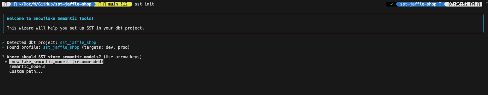

2. Follow the prompts in the wizard to finish setting up SST in your dbt project. For the sake of this tutorial, we will just go with the defaults:
    - Where should SST store semantic models? **_snowflake_semantic_models (recommended)_**
    - Create example semantic models? **_Yes, show me examples_**
    - Test Snowflake connection? **_Yes_**
    - The following will be created:
        ```
            sst_config.yaml (new)
            snowflake_semantic_models/ (new directory)
            ├── metrics/_examples.yml
            ├── relationships/_examples.yml
            ├── filters/_examples.yml
            ├── verified_queries/_examples.yml
            ├── custom_instructions/_examples.yml
            ├── semantic_views.yml
            └── README.md
        ```
        Proceed? (Y/n) **_y_**
3. If you followed all of the steps correctly, you will see an output that should reflect the following image:

    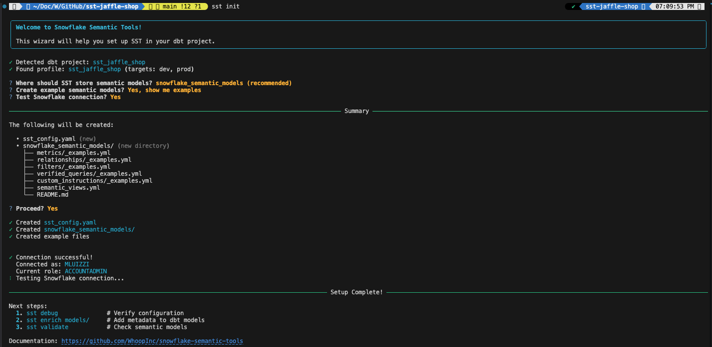

    And the files that it says were created should now be in your dbt project.

## Step 6 - Enriching our dbt models
1. With dbt now initialized and installed in our project, we need to enrich our dbt models. As you can see in the image below, we have several dbt SQL models in this project currently. We will use SST to create a YAML model for each of these.
    
    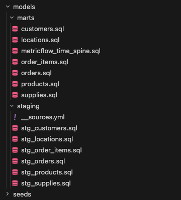

2. We will start by enriching a single model, customers. In your terminal run the following command:
    ```
    sst enrich --models customers --all
    ```
    Now in your project you will see a new YAML file for the customers model. SST was able to go to Snowflake and fill that all in, and used Cortex to generate synonyms. The only thing left for you to do is add a primary key (it is `customer_id` for this model) and add in descriptions for the model and each column (we don't use Cortex for that because dbt models can get complicated and we don't want to assume).

    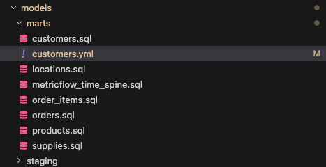

3. Next, we can enrich all of the other models in one command. Simply run the following and watch the YAMLs appear:
    ```
    sst enrich models/ --all
    ```

4. And that's it! Now you have all of the metadata you need to build out the dimensions, time dimensions and facts for a Snowflake Semantic View natively in your dbt project.

## Step 7 - Adding Metrics
In the `/snowflake_semantic_models/metrics/` you can see there are some exmaple metrics, all commented out. Let's build some of our own for the Jaffle Shop.

1. Create a file called `metrics.yml` (can really be called anything)
2. In the file, paste in the following code:
```
snowflake_metrics:
  - name: total_orders
    description: Total number of orders placed
    tables:
      - {{ table('orders') }}
    expr: COUNT(DISTINCT {{ column('orders', 'order_id') }})
    synonyms:
      - order count
      - number of orders
      - total order count

  - name: total_revenue
    description: Total revenue from all orders including tax
    tables:
      - {{ table('orders') }}
    expr: SUM({{ column('orders', 'order_total') }})
    synonyms:
      - total sales
      - gross revenue
      - total order value

  - name: drink_orders
    description: Number of orders containing drink/beverage items
    tables:
      - {{ table('orders') }}
    expr: |
      COUNT(DISTINCT CASE 
        WHEN {{ column('orders', 'is_drink_order') }} = TRUE 
        THEN {{ column('orders', 'order_id') }} 
      END)
    synonyms:
      - orders with drinks
      - beverage order count
      - drink order count

  - name: total_customers
    description: Total number of unique customers
    tables:
      - {{ table('customers') }}
    expr: COUNT(DISTINCT {{ column('customers', 'customer_id') }})
    synonyms:
      - customer count
      - number of customers
      - total customer count

  - name: repeat_customers
    description: Number of customers who have made more than one order
    tables:
      - {{ table('customers') }}
    expr: |
      COUNT(DISTINCT CASE 
        WHEN {{ column('customers', 'count_lifetime_orders') }} > 1 
        THEN {{ column('customers', 'customer_id') }} 
      END)
    synonyms:
      - returning customers
      - repeat buyers
      - loyal customers
```

3. As you can see, we have defined 5 metrics. We just need to put in the metric name, a description, a reference to the table(s) required for that metric, a valid Snowflake SQL syntax and some synonyms.

## Step 7 - Adding Relationships
Now let's repeat the same process for relationships.
1. In the `/snowflake_semantic_models/relationships/` directory, create a file called `relationships.yml`.
2. Paste in the following code which will define some relationships between our tables:
```
snowflake_relationships:
  # Standard equality relationships (existing)
  - name: orders_to_customers
    left_table: {{ table('orders') }}
    right_table: {{ table('customers') }}
    relationship_conditions:
      - "{{ column('orders', 'customer_id') }} = {{ column('customers', 'customer_id') }}"

  - name: order_items_to_orders
    left_table: {{ table('order_items') }}
    right_table: {{ table('orders') }}
    relationship_conditions:
      - "{{ column('order_items', 'order_id') }} = {{ column('orders', 'order_id') }}"

  - name: order_items_to_products
    left_table: {{ table('order_items') }}
    right_table: {{ table('products') }}
    relationship_conditions:
      - "{{ column('order_items', 'product_id') }} = {{ column('products', 'product_id') }}"

  - name: orders_to_locations
    left_table: {{ table('orders') }}
    right_table: {{ table('locations') }}
    relationship_conditions:
      - "{{ column('orders', 'location_id') }} = {{ column('locations', 'location_id') }}"
```

## Step 7 - Defining a Semantic View
Now that we have all the components of a Semantic View defined in our project, we can bring it together into a Semantic View definition.

1. When you ran `sst init` a file called `/snowflake_semantic_models/semantc_views.yml` was created. You can remove the contents of that file.
2. In the file, paste in the following semantic view definitions:
```
semantic_views:
  - name: customer_360
    description: Comprehensive view of orders, customers, and products for sales analytics
    tables:
      - {{ table('orders') }}
      - {{ table('customers') }}
      - {{ table('order_items') }}
      - {{ table('products') }}
      - {{ table('locations') }}
```
And that's all there is to it! The power of SST is that by simply defining the tables you want included in a Semantic View, you can keep the definitions simple while the tools engine will compile all of the pieces. As you add dimensions, metrics, etc., to your dbt/SST models, they are propogated to Snowflake in your Semantic Views with no additional work.

## Step 8 - Validate our Work
SST has a built in tool to validate that everything we have done is valid. Let's

1. In your same terminal, run the following:
    ```
    sst validate
    ```
2. This will check all of your syntax and YAML formatting across the board and catch any issues that you might have before Snowflake throws an error later.
3. Assuming everything has been done correctly so far, you will see an output that matches the following:

    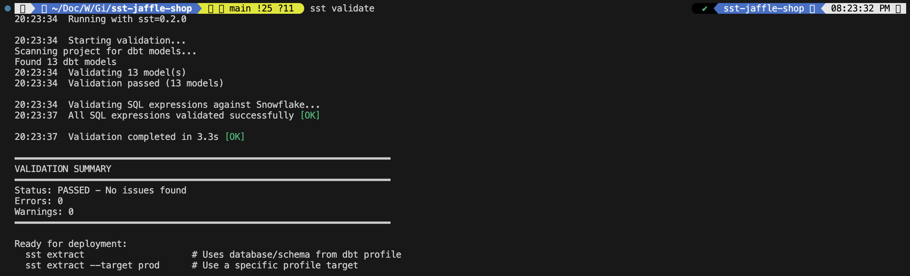

## Step 9 - Extract Metadata to Snowflake
In order to support multiple environments (dev/prod/etc) and increase performance, we will be parsing, extracting and writing all of the metadata to Snowflake and creating some tables.

1. In your same terminal, run the following:
    ```
    sst extract
    ```

2. Since we set our default profile to be dev, this will create tables in the `dev.sst_jaffle_shop` schema in Snowflake.
3. Assuming the Snowflake credentials are set up correctly in the `profiles.yml` file and all prior steps have been followed, you will see an output matching the following:

    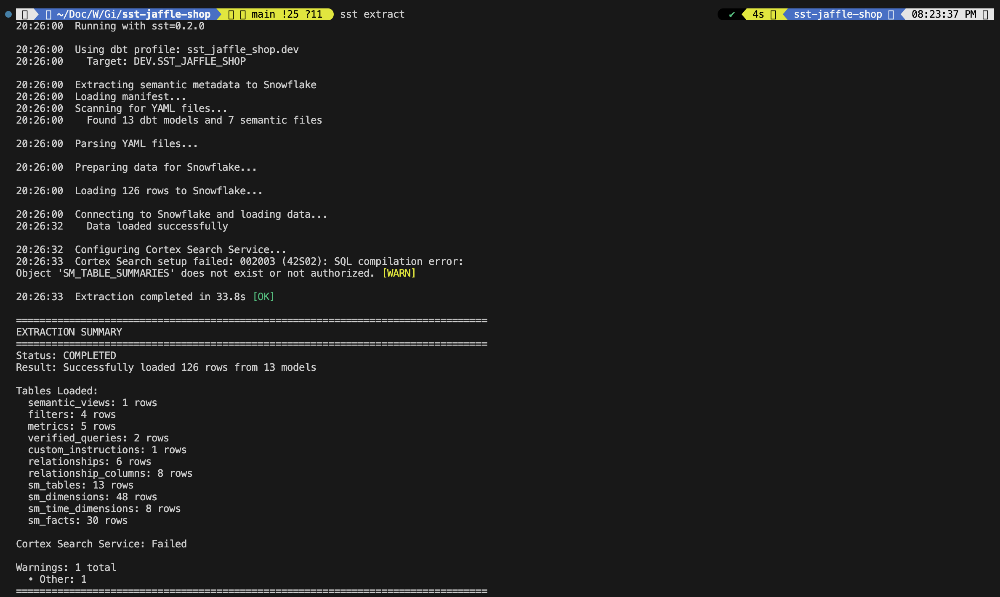

> Note: There will be a warning for the search service not being created, but we can ignore that as it is outside the scope of this tutorial.

4. In Snowflake, you can now see a bunch of tables we an `sm_` prefix exist. Feel free to poke around those and explore the contents.
    
    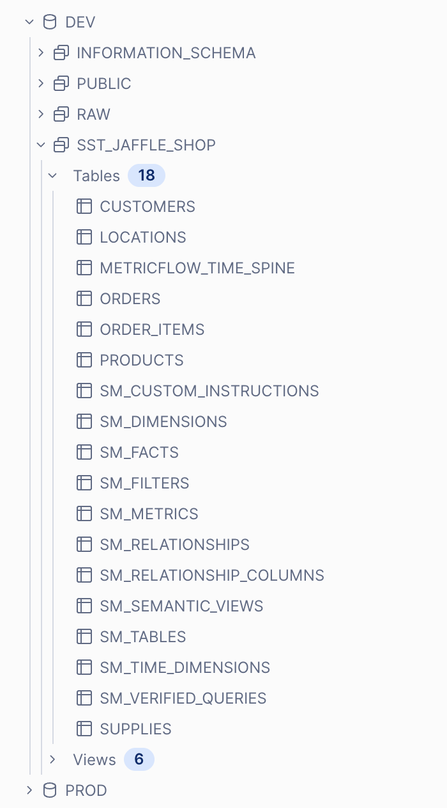

## Step 10 - Generate the Semantic Views
The final step in this process is creating the semantic views.

1. In the same terminal, run the following:
    ```
    sst generate --all
    ```

2. This command tells SST to create all of the semantic views that are defined in the project. And as you can see in the image below, this will show you the semantic model is now built:

    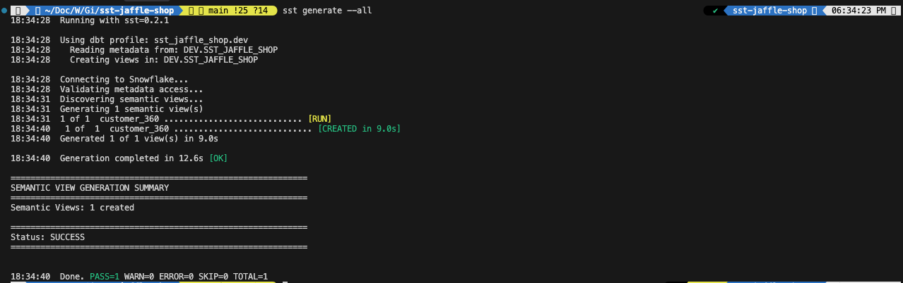

## Step 11 - Seeing what happened in Snowflake

1. Going back to our Snowflake window, in your database explorer you should now see a semantic view called `customer_360` that was created:

    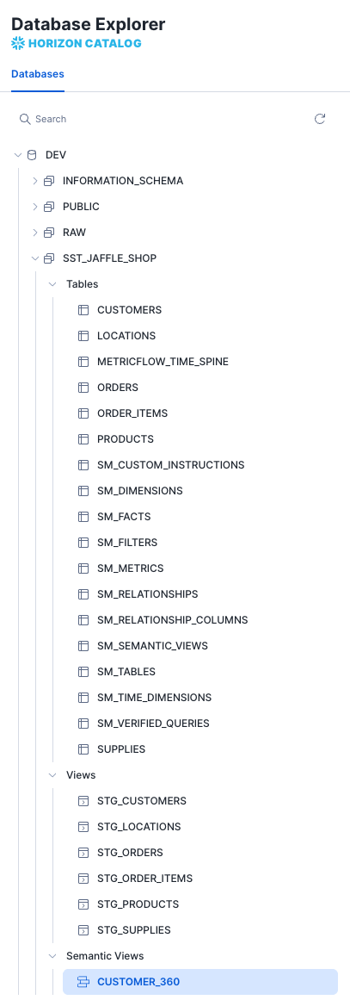

2. And if you click into the Semantic View, you will see the DDL statement that SST created to generate the semantic view:
    
    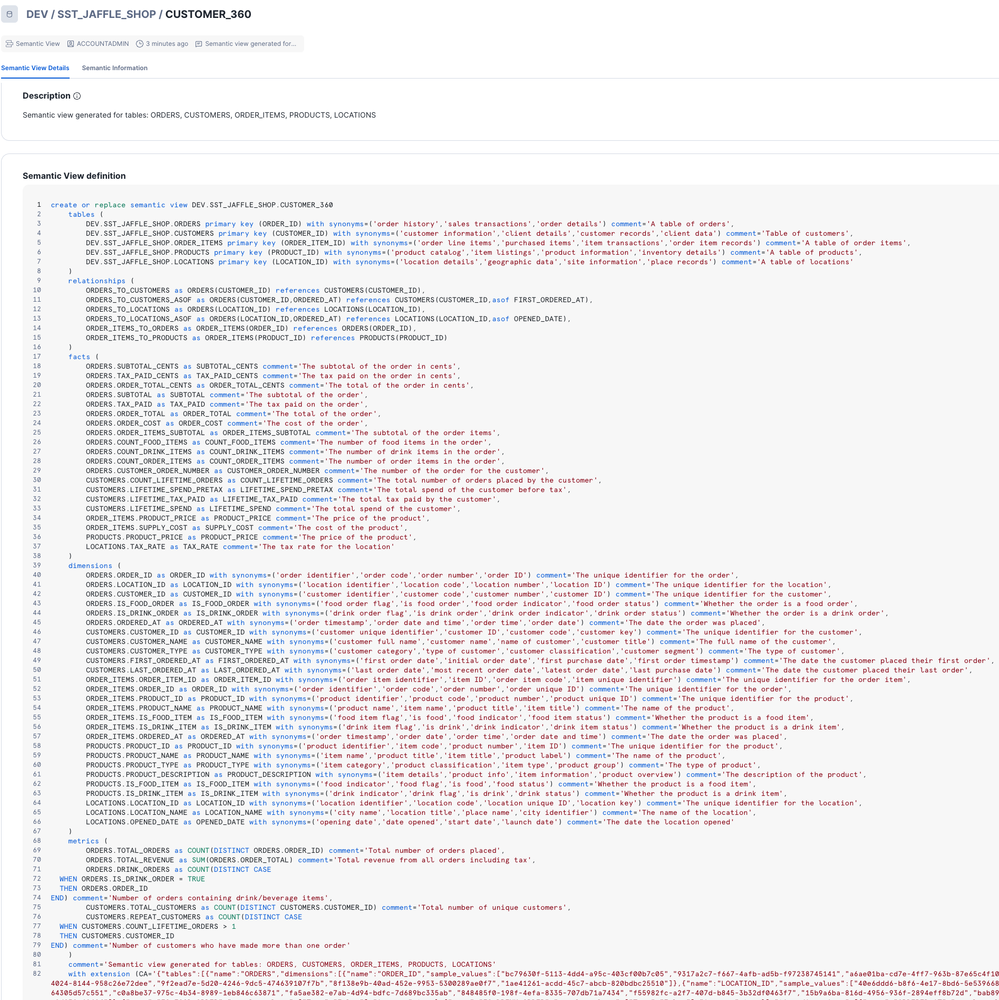

3. And of course, all of the semantic information is neatly organized as we intended it to be.

    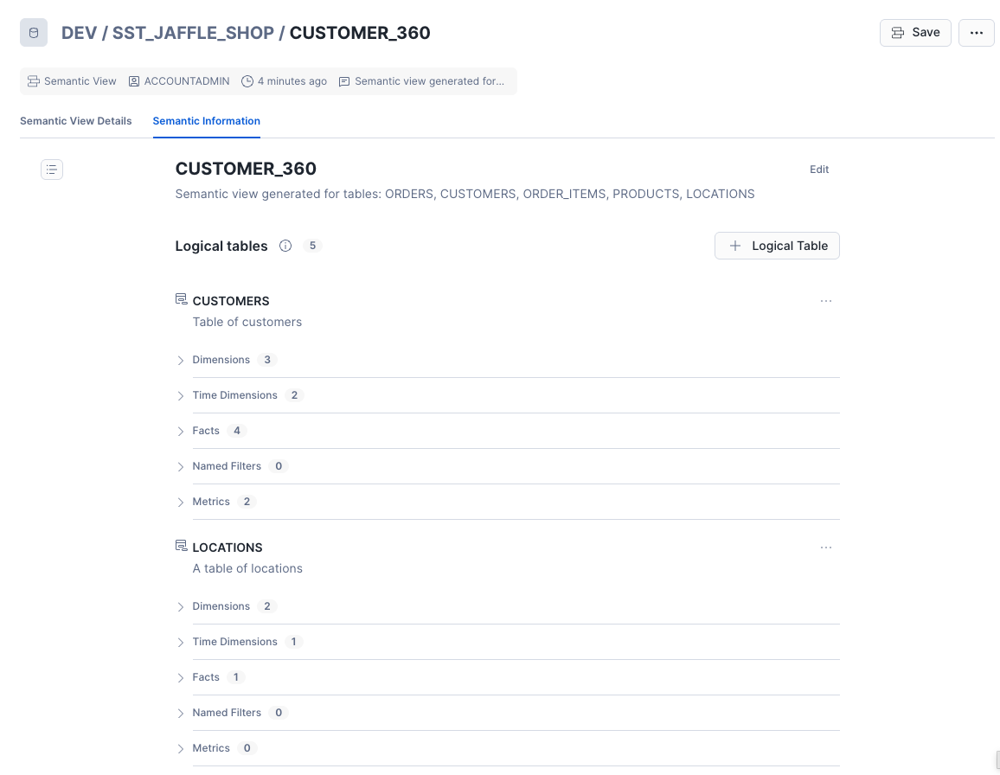

## Step 12 - Querying the Semantic View

1. Now you can use the Semantic View query syntax to query our view. Try this sample query:
    ```
    select * from semantic_view(
        dev.sst_jaffle_shop.customer_360
        dimensions customers.customer_name
        metrics orders.total_revenue
    )
    order by total_revenue desc;
    ```
    
    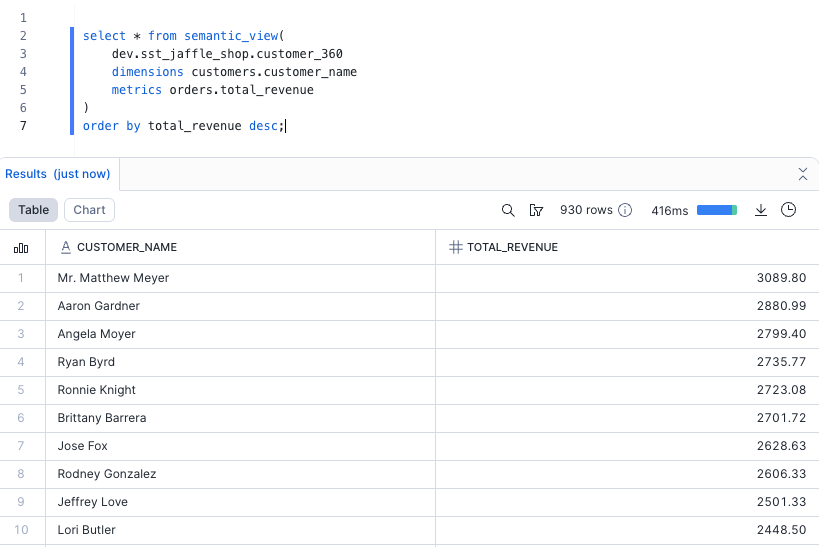

2. And that's it!

---

Thanks for checking out this tutorial. Please try out SST yourself and reach out to the team with feedback - we're looking for ideas to make this better!